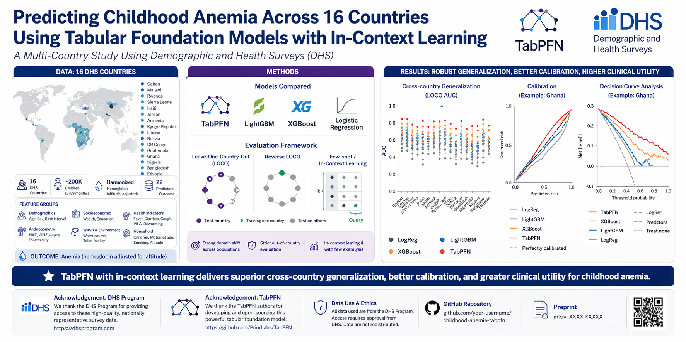
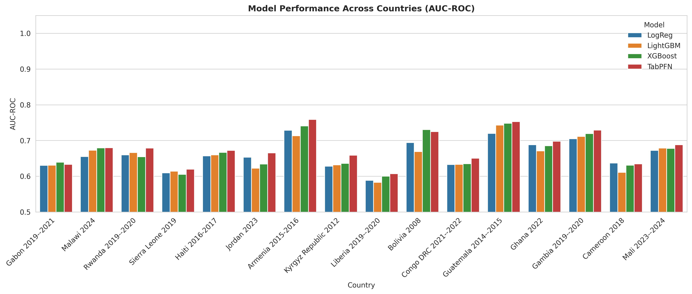
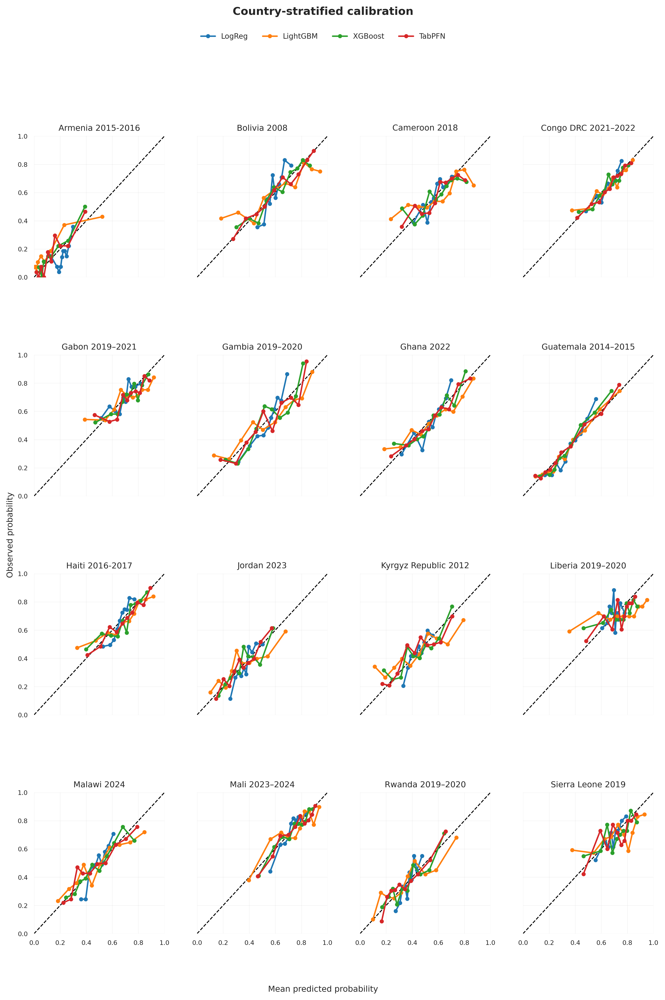
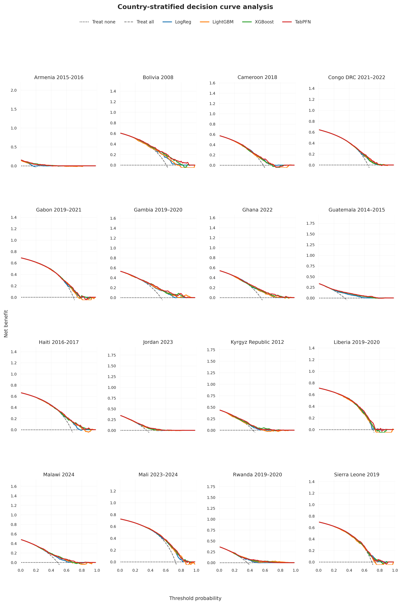

<!-- ===================== HERO SECTION ===================== -->

<p align="center">
  
</p>

<h1 align="center">
🧠 Predicting Childhood Anemia Across Multiple Countries Using Tabular Foundation Models
</h1>

<p align="center">
  <a href="https://www.python.org/">
    
  </a>
  <a href="https://doi.org/">
    
  </a>
  <a href="https://arxiv.org/">
    
  </a>
  <a href="LICENSE">
    
  </a>
</p>

---

## 📄 Overview

This repository supports the manuscript:

**“Predicting Childhood Anemia Across Multiple Countries Using Tabular Foundation Models with In-Context Learning: A Multi-Country Study Using Demographic and Health Surveys (DHS)”**

We evaluate whether **tabular machine learning and foundation models (including TabPFN)** can generalize across diverse low- and middle-income country populations under strong domain shift using harmonized DHS data.

---

## 🌍 Countries Included

- Gabon (2019–2021)  
- Malawi (2024)  
- Rwanda (2019–2020)  
- Sierra Leone (2019)  
- Haiti (2016–2017)  
- Jordan (2023)  
- Armenia (2015–2016)  
- Kyrgyz Republic (2012)  
- Liberia (2019–2020)  
- Bolivia (2008)  
- Democratic Republic of Congo (2021–2022)  
- Guatemala (2014–2015)  
- Ghana (2022)  

---

## 🧬 Key Results

### 📊 Model Performance Across Countries


### 📈 Calibration Across Countries


### 🤖 Feature Importance (TabPFN)


### ⚖️ Clinical Utility (Decision Curve Analysis)


---

## 🚀 How to Run the Pipeline


## 🧪 Pipeline Notes

* Steps must be executed sequentially
* Intermediate outputs are reused across scripts
* Optuna tuning may require significant compute time
* LOCO and reverse LOCO are core generalization experiments
* Calibration + subgroup analysis evaluate clinical robustness

---

## 🤖 Tabular Foundation Model (TabPFN)

This study uses **TabPFN**, a transformer-based model for tabular data that performs **in-context learning without task-specific training**.

We acknowledge the authors of TabPFN for enabling foundation-model benchmarking in structured health data.

---

## 📦 Installation

```bash
pip install -r requirements.txt
```

---

## 🧾 Requirements

* Python ≥ 3.9
* numpy
* pandas
* scipy
* scikit-learn
* lightgbm
* xgboost
* optuna
* joblib
* pyreadstat
* statkit
* dcurves
* tabpfn
* pytorch
* cupy-cuda12x

---

## 🗂️ Data Source (DHS Program)

All data originate from the **Demographic and Health Surveys (DHS) Program**.

[https://dhsprogram.com/Data/](https://dhsprogram.com/Data/)

---

## 🎯 Outcome Definition

Childhood anemia is defined using hemoglobin concentration adjusted for altitude according to WHO guidelines.

---

## 🧪 Experimental Design

* Multi-country DHS harmonization
* Leave-One-Country-Out (LOCO) validation
* Reverse LOCO evaluation
* Few-shot / in-context learning
* Subgroup fairness analysis
* Calibration & uncertainty estimation
* Decision curve analysis
* Classical ML vs foundation models comparison

---

## 📌 Research Objective

To evaluate whether **tabular foundation models can generalize across countries under strong distribution shift in global health datasets**.

---

### ⚙️ Full End-to-End Workflow

Run scripts **in the exact order below**:

---

### 1️⃣ Extract DHS file registry
```bash
python extract.py
````

---

### 2️⃣ Harmonize dataset registry

```bash
python harmonize.py
```

---

### 3️⃣ Clean and merge datasets

```bash
python merge.py
```

---

### 4️⃣ Hyperparameter optimization (Optuna)

```bash
python hyperparam.py
```

---

### 5️⃣ Train baseline anemia models

```bash
python anemia_eff.py
```

---

### 6️⃣ Leave-One-Country-Out (LOCO) validation

```bash
python loco.py
```

---

### 7️⃣ Reverse LOCO validation

```bash
python loco_reverse.py
```

---

### 8️⃣ Summary statistics

```bash
python constructor.py
```

---

### 9️⃣ Few-shot / in-context learning experiments

```bash
python few_shot.py
```

---

### 🔟 Subgroup analysis (fairness evaluation)

```bash
python sub_group_final.py
```

---

### 1️⃣1️⃣ Calibration analysis

```bash
python calibration.py
```

---

## 📄 License

MIT License

Copyright (c) 2026 Yusuf Brima

Permission is hereby granted, free of charge, to any person obtaining a copy
of this software and associated documentation files (the "Software"), to deal
in the Software without restriction, including without limitation the rights
to use, copy, modify, merge, publish, distribute, sublicense, and/or sell
copies of the Software, and to permit persons to whom the Software is
furnished to do so, subject to the following conditions:

The above copyright notice and this permission notice shall be included in all
copies or substantial portions of the Software.

THE SOFTWARE IS PROVIDED "AS IS", WITHOUT WARRANTY OF ANY KIND, EXPRESS OR
IMPLIED, INCLUDING BUT NOT LIMITED TO THE WARRANTIES OF MERCHANTABILITY,
FITNESS FOR A PARTICULAR PURPOSE AND NONINFRINGEMENT. IN NO EVENT SHALL THE
AUTHORS OR COPYRIGHT HOLDERS BE LIABLE FOR ANY CLAIM, DAMAGES OR OTHER
LIABILITY, WHETHER IN AN ACTION OF CONTRACT, TORT OR OTHERWISE, ARISING FROM,
OUT OF OR IN CONNECTION WITH THE SOFTWARE OR THE USE OR OTHER DEALINGS IN THE
SOFTWARE.